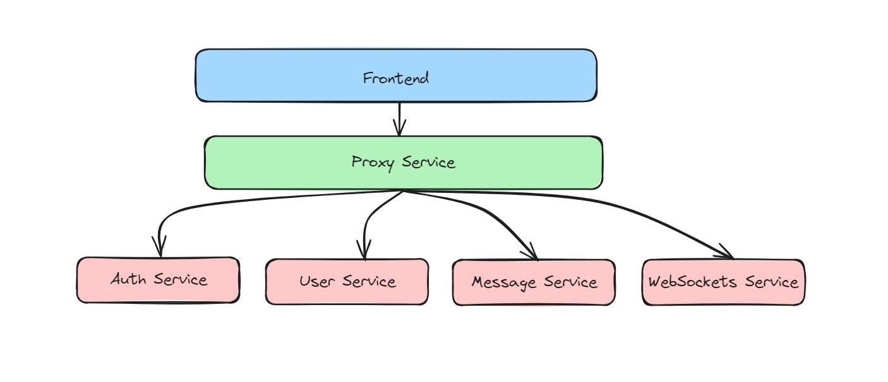

# Chat Application

Developed a scalable chat application in JavaScript, leveraging WebSockets, React, Kubernetes, and Docker to understand microservices architecture.

This application supports two different architectures: monolithic and microservices.

## Getting Started

### Microservices Architecture


To run the application in microservices architecture:
1. Build Docker images for each microservice backend and push them to your Docker Hub repository.
2. Update the Kubernetes deployment scripts (configmap.yaml) with your Docker Hub repository details.
3. Run the deploy-script.sh script.

### Monolithic Architecture

To run the application in monolithic architecture:

1. Clone the repository.
2. ```sh
   cd backend
   ```
3. Create a `.env` file in the root directory with necessary environment variables.
4. Install dependencies:
   ```sh
   npm install
   ```
5. Run the server:
   ```sh
   node index.js
   ```
6.  Go to client directory and run the frontend code.

This application is developed for educational purposes.
